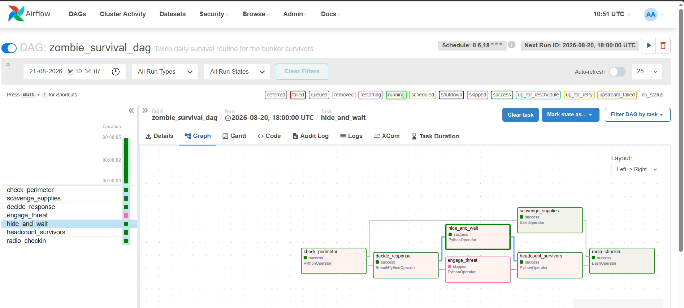

# Zombie Survival Ops — Apache Airflow Assignment

**Assignment: Day 1, "Automate or Die"**

This repository holds a self-running Apache Airflow pipeline that stands in
for a survival group's twice-daily routine after the outbreak: check the
fence line, go looking for supplies, decide whether to fight or hole up,
count heads, and radio the result back to other camps.

---

## Contents

- [What this pipeline does](#what-this-pipeline-does)
- [Repository layout](#repository-layout)
- [Before you start](#before-you-start)
- [Getting it running](#getting-it-running)
- [How the tasks connect](#how-the-tasks-connect)
- [What gets passed between tasks](#what-gets-passed-between-tasks)
- [Why one branch always skips](#why-one-branch-always-skips)
- [Why it runs at 06:00 and 18:00](#why-it-runs-at-0600-and-1800)
- [Engineering choices worth noting](#engineering-choices-worth-noting)
- [Triggering a run from the REST API](#triggering-a-run-from-the-rest-api)
- [Screenshots to submit](#screenshots-to-submit)
- [Deliverables checklist](#deliverables-checklist)
- [If something breaks](#if-something-breaks)

---

## What this pipeline does

Picture the setup: the news called it "an isolated incident," and six hours
later the only functioning machine in the bunker happens to be running
Airflow. Rather than have someone re-run the same eight-step checklist by
hand every sunrise and sunset, that checklist has been turned into a DAG.

Seven tasks make up the pipeline. It mixes a `BashOperator` with several
`PythonOperator` tasks, branches on a simulated threat score, hands data
between tasks through XCom, and — as the assignment requires — leaves
exactly one of two possible response tasks skipped on every run.

---

## Repository layout

```
zombie-survival-airflow/
├── docker-compose.yaml         Postgres, webserver, scheduler, init services
├── .env                        AIRFLOW_UID, so file permissions behave
├── README.md                   You're reading it
├── dags/
│   └── zombie_survival_dag.py  The pipeline definition
├── logs/                       Populated by Airflow once tasks run
├── plugins/                    Unused, kept because the image expects it
├── config/                     Unused, same reason
└── screenshots/
    ├── graph_view_completed_run.png
    └── api_trigger_request_response.png
```

A few things worth knowing about these folders before you go looking for
something that isn't there:

- Airflow only ever scans `dags/`. Because `docker-compose.yaml` mounts it
  straight into the containers, saving a change to `zombie_survival_dag.py`
  gets picked up by the scheduler in roughly 20 seconds — no restart needed.
- `logs/` is empty until you actually run something; there's nothing to
  set up in advance.
- `plugins/` and `config/` are only present because the official Airflow
  image expects those mount points to exist. Neither is used here.
- `screenshots/` is where the two graded images belong — see the
  [Screenshots](#screenshots-to-submit) section for the exact names.

---

## Before you start

You'll need:

- Docker Desktop (Mac/Windows) or Docker Engine + the Compose plugin
  (Linux), already running.
- Roughly 4 GB of memory free for Docker to use.
- A terminal — Command Prompt, PowerShell, or a Mac/Linux shell.
- Postman or just a browser, for firing the trigger request later.

---

## Getting it running

1. **Get into the project folder and confirm you're in the right spot.**

   ```
   cd zombie-survival-airflow
   ls          # Mac/Linux
   dir         # Windows
   ```

   You should see `docker-compose.yaml` sitting right there, not tucked
   inside another folder.

2. **On Mac/Linux, line up your user ID with the container's.**

   ```
   id -u
   ```

   If that doesn't print `50000`, open `.env` and swap in whatever number
   it did print — this heads off permission errors on `dags`, `logs`, and
   `plugins`. Windows users can skip this step entirely.

3. **Run the one-time setup.** This builds the metadata database and the
   admin account.

   ```
   docker compose up airflow-init
   ```

   Let it finish and exit with code 0 before moving on.

4. **Bring the stack up in the background.**

   ```
   docker compose up -d
   ```

5. **Give it 30–60 seconds**, then visit `http://localhost:8080` and sign
   in with `airflow` / `airflow`.

6. **Locate `zombie_survival_dag` in the list and flip its toggle on.**
   Left paused, it simply won't run, even if triggered.

7. **When you're done for the day:**

   ```
   docker compose down
   ```

   Tack on `-v` only if you also want the database volume wiped for a
   clean start next time.

---

## How the tasks connect

```
                    ┌────────────────────┐
                    │  check_perimeter   │
                    │  (PythonOperator)  │
                    └─────────┬──────────┘
                              │
                ┌─────────────┴─────────────┐
                ▼                           ▼
   ┌────────────────────┐       ┌──────────────────────┐
   │  scavenge_supplies  │       │   decide_response     │
   │  (BashOperator)     │       │ (BranchPythonOperator) │
   └──────────┬──────────┘       └──────────┬─────────────┘
              │                             │
              │                 ┌───────────┴───────────┐
              │                 ▼                       ▼
              │      ┌────────────────────┐  ┌────────────────────┐
              │      │   engage_threat    │  │   hide_and_wait     │
              │      │  (PythonOperator)  │  │  (PythonOperator)   │
              │      └──────────┬─────────┘  └──────────┬──────────┘
              │                 └───────────┬────────────┘
              │                             ▼
              │                ┌────────────────────────┐
              │                │ headcount_survivors     │
              │                │  (PythonOperator)       │
              │                └────────────┬────────────┘
              │                             │
              └─────────────┬───────────────┘
                            ▼
                 ┌────────────────────┐
                 │   radio_checkin    │
                 │  (BashOperator)    │
                 └────────────────────┘
```

**The reasoning behind the shape:**

Everything opens with `check_perimeter` — the scout at the fence line,
producing a threat score. `scavenge_supplies` fires immediately alongside
it, since a supply run doesn't need to wait on whether the coast is clear.
That threat score then reaches `decide_response`, the branch task, which
sends the run down exactly one path: `engage_threat` if the score crosses
the line into "zombies spotted," or `hide_and_wait` if things look quiet.
Both of those paths converge on `headcount_survivors` — heads get counted
no matter which way the day went. `radio_checkin` closes things out,
folding together the supply count, the survivor count, and whichever
response outcome fired, into one report for the other camps.

---

## What gets passed between tasks

| Producer               | XCom key             | Read by                                            | Purpose                                                            |
|-------------------------|-----------------------|-----------------------------------------------------|----------------------------------------------------------------------|
| `check_perimeter`        | `threat_score`         | `decide_response`, `engage_threat`, `hide_and_wait` | branch decision without a second perimeter scan                     |
| `check_perimeter`        | `zombies_detected`      | `decide_response`                                   | the boolean the branch actually keys off                            |
| `scavenge_supplies`      | return value (supply units) | `radio_checkin`                                | lets the final report cite stock levels without repeating the search |
| `engage_threat`          | `response_outcome`      | `radio_checkin`                                     | what happened if the fight branch ran                               |
| `hide_and_wait`          | `response_outcome`      | `radio_checkin`                                     | what happened if the hide branch ran                                |
| `headcount_survivors`    | `survivor_count`         | `radio_checkin`                                     | so the report states exactly how many people are left               |

---

## Why one branch always skips

`decide_response` is a `BranchPythonOperator`: it returns the task ID
`engage_threat` when `zombies_detected` is `true`, and `hide_and_wait`
otherwise. Whichever of the two it doesn't return, Airflow marks as
**skipped** automatically — that's the deliberate skip the assignment asks
for.

`decide_response`'s logs spell out the exact threat score alongside the
threshold it was measured against, so the reasoning behind which branch
ran (and which didn't) is reconstructable after the fact.

---

## Why it runs at 06:00 and 18:00

```
0 6,18 * * *
```

A survival routine doesn't happen once a day — it happens at shift
change: dawn, before anyone leaves the bunker, and dusk, before night
falls. That's a closer match to how the group would actually need to
operate than a plain `@daily` schedule would give.

---

## Engineering choices worth noting

- **Real logging, no `print` statements** — every task writes through
  `context["ti"].log`, exercising every level from `debug` to `critical`,
  particularly to explain *why* a task got skipped.
- **Descriptive naming throughout** — task IDs and variables say what
  they do: `check_perimeter`, `zombies_detected`, `survivor_count`.
- **Nothing hardcoded** — the engage threshold, minimum survivor count,
  and base callsign all come from Airflow Variables with sane defaults,
  rather than being baked into the code.
- **PEP8-clean** — checked with `flake8`, 100-character line limit.

---

## Triggering a run from the REST API

Triggering through the REST API — not the UI button — is a **required**
part of this deliverable.

**Via Swagger UI**

1. Open `http://localhost:8080/api/v1/ui`.
2. Log in with `airflow` / `airflow`.
3. Find `POST /dags/{dag_id}/dagRuns` and click **Try it out**.
4. Set `dag_id` to `zombie_survival_dag`.
5. Supply a unique run ID in the body, e.g.:

   ```json
   {
     "dag_run_id": "manual_zombie_run_1"
   }
   ```

6. Click **Execute** and check that the response comes back with a
   `dag_run_id` and a state like `"queued"`.

**Via Postman**

- Method: `POST`
- URL: `http://localhost:8080/api/v1/dags/zombie_survival_dag/dagRuns`
- Auth: Basic, `airflow` / `airflow`
- Body (raw JSON):

  ```json
  {
    "dag_run_id": "manual_zombie_run_1"
  }
  ```

Screenshot both the request and the response — see below for where that
image goes.

---

## Screenshots to submit

Save both under `screenshots/` using these exact names so they render
wherever this file is viewed.

**1. Completed run, graph view** — the full task graph after a run
finishes, with one of `engage_threat` / `hide_and_wait` visibly skipped.

`screenshots/graph_view_completed_run.png`



**2. API trigger, request and response** — the DAG being triggered via
Swagger or Postman, response included, showing the run ID and its state.

`screenshots/api_trigger_request_response.png`


> Using different file names is fine — just point the two image lines
> above at whatever you actually saved.

---

## Deliverables checklist

- [x] `zombie_survival_dag.py` — commented, PEP8-compliant
- [ ] Screenshot: graph view of a completed run, skipped task visible
- [ ] Screenshot: API trigger request and its response
- [x] This README — task flow, XCom usage, skip condition, schedule
      rationale

---

## If something breaks

**"no configuration file provided"** — you're not standing in the folder
that has `docker-compose.yaml` in it. Check with `pwd` (Mac/Linux) or a
bare `cd` (Windows), then move into the right folder and confirm the file
is there before retrying.

**DAG not showing up in the UI** — give the scheduler ~30 seconds, then
check "DAG Import Errors" at the top of the Airflow UI for a syntax or
import issue.

**DAG stuck paused after you toggle it** — refresh the page. New DAGs
start paused, and the toggle takes a beat to register.

**Permission errors writing to `logs/` or `dags/` on Linux** — your
`AIRFLOW_UID` in `.env` doesn't match your real user ID. Run `id -u`,
update `.env` accordingly, and rerun `docker compose up airflow-init`.