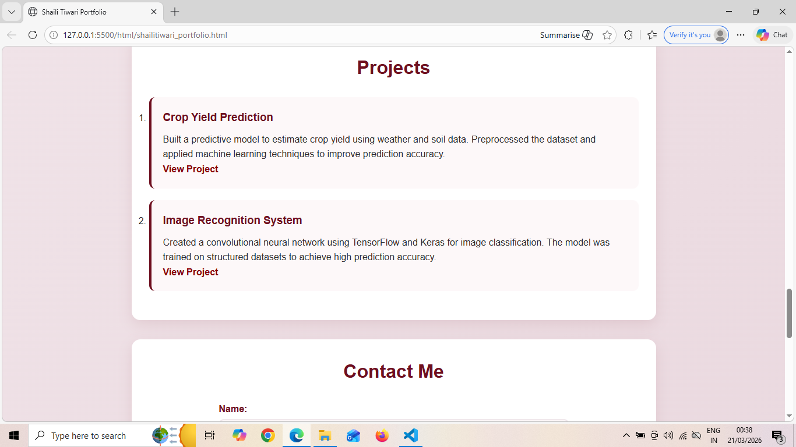

# Personal Portfolio Website - CSS Styling

## Overview
This project is an extension of my HTML portfolio where I focused on improving the visual design using CSS.  
The goal was to make the layout clean, readable, and slightly modern while still keeping it simple.

---

## UI Design Approach

While designing the UI, I tried to keep a **professional resume feel** instead of making it overly decorative.

- Used a **maroon-based color theme** to give a strong and elegant look
- Added **soft gradients** in header and background to avoid flat colors
- Maintained proper **contrast for readability**
- Used **card-like sections** to separate content clearly

---

##  Layout & Styling Decisions

###  Header
- Applied a **gradient background** to highlight profile section
- Center aligned content for better focus
- Profile image styled as **circular with border and shadow**

###  Navigation
- Converted default list into a **horizontal menu using flexbox**
- Added hover effects to improve user interaction
- Used soft color transitions instead of harsh changes

###  Sections
- Each section is styled like a **card**
- Added spacing, border-radius and shadow for separation
- Used consistent padding for clean structure

###  Skills
- Added **left border highlight** to make categories stand out
- Used spacing instead of heavy styling to keep it readable

###  Education Table
- Styled with **header background color**
- Added row hover effect for better visibility
- Used alternate row coloring for readability

###  Projects
- Designed as **small content blocks**
- Highlighted project titles with theme color
- Links are clearly visible and change color on hover

###  Form
- Kept layout simple and aligned
- Inputs styled uniformly
- Focus effect added for better usability

###  Footer
- Kept minimal and clean
- Matches overall theme

---

##  Responsiveness

- Used **media queries** for smaller screens
- Navigation switches to vertical layout on mobile
- Adjusted image and section sizes for better fit

---

## 📸 Screenshots

(Add your screenshots here)

Example:

---

