# Java Fundamentals Assignment

##  Student Details
- Name: Shaili Tiwari   
- Java Fundamentals Assignment Session1  

##  Project Structure

---

#  BASIC JAVA

## Q1. Area Calculator (Circle, Rectangle, Triangle) 
Program calculates area based on user input.

Output Screenshot: 
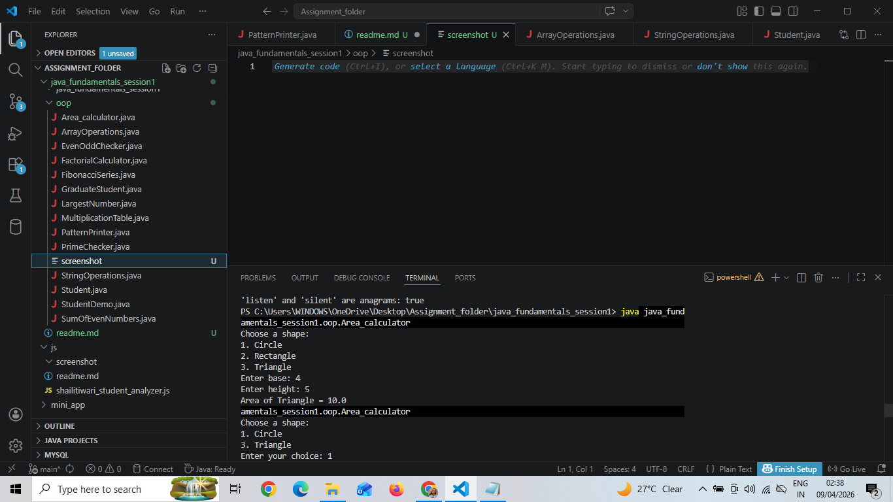

---

## Q2. Even or Odd Checker
  
Checks whether a number is even or odd.

Output Screenshot:
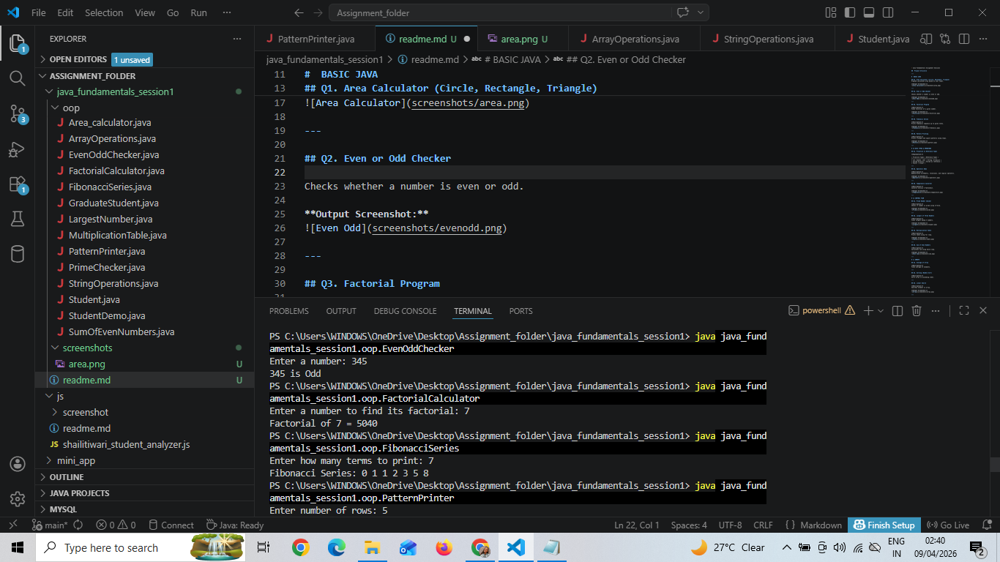

---

## Q3. Factorial Program

Finds factorial of a given number.

Output Screenshot:  

---

## Q4. Fibonacci Series

Prints Fibonacci sequence up to given terms.

Output Screenshot:  

---

## Q5. Pattern Printing
Prints triangle and square patterns using loops.

Output Screenshot:  
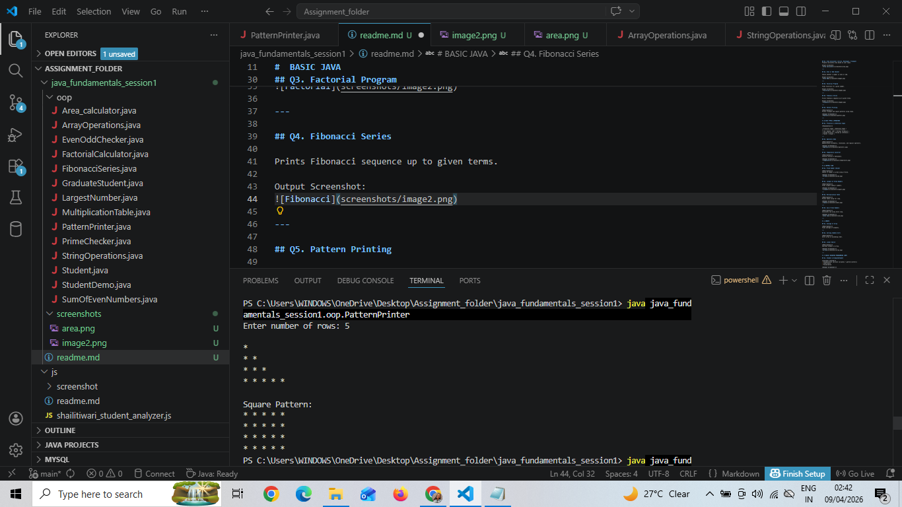

---

# DATA TYPES & OPERATORS

## Q1. Primitive vs Reference Types

Explanation:

| Primitive Types | Reference Types |
|----------------|----------------|
| int, double, char | String, ArrayList |
| Stored directly | Stored as reference |
| Faster | Slower |

---

## Q2. Operators Demo
Demonstrates arithmetic, relational, and logical operators.

Output Screenshot:

---

## Q3. Temperature Converter
Converts Celsius ↔ Fahrenheit.

Output Screenshot: 
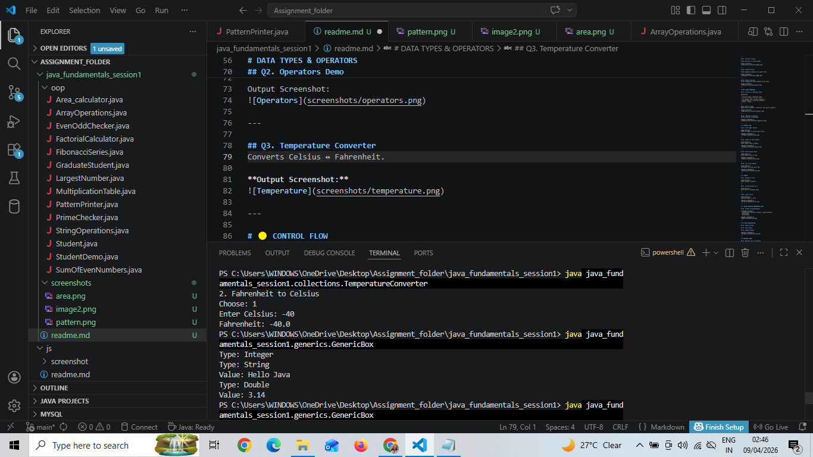

---

# CONTROL FLOW

## Q1. Prime Number Checker
  
Checks if number is prime using if-else.

Output Screenshot:  
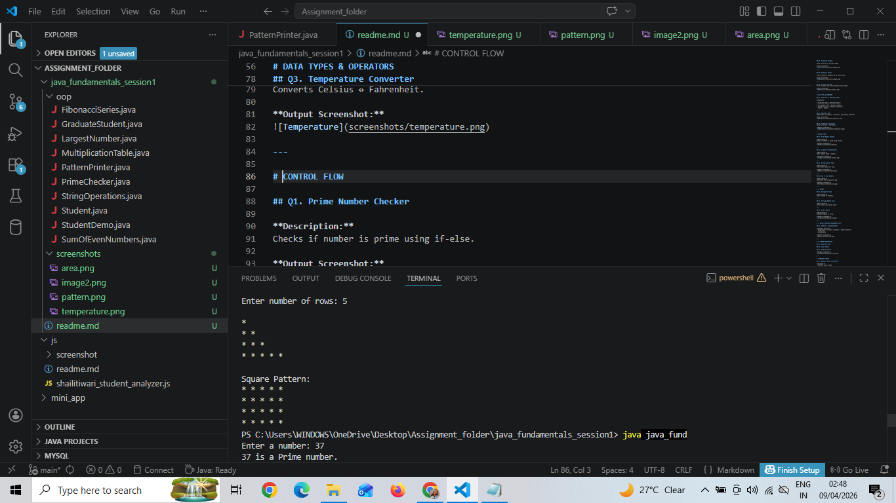

---

## Q2. Largest of Three Numbers
Finds largest among 3 numbers.
Output Screenshot:  
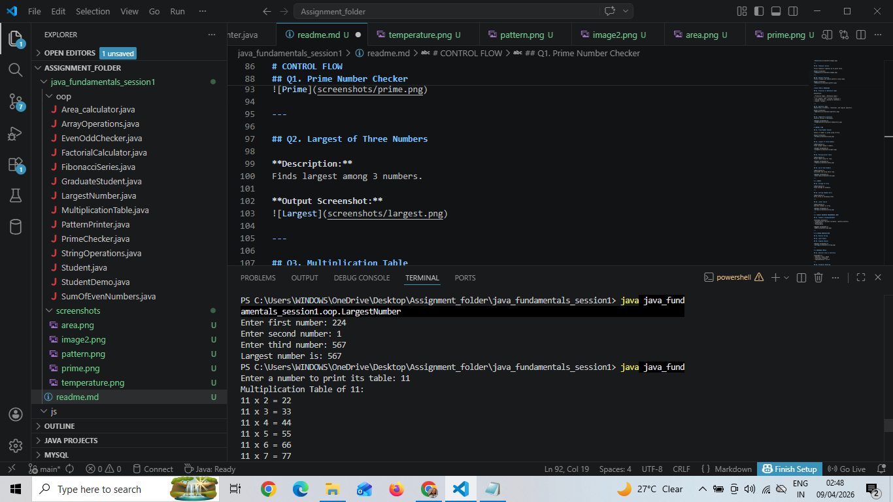

---

## Q3. Multiplication Table
Prints table using for loop.

Output Screenshot:  
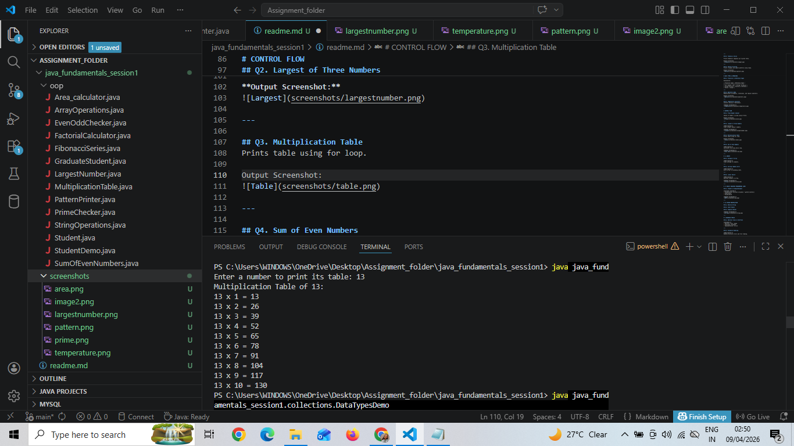

---

## Q4. Sum of Even Numbers
Calculates sum using while loop.

Output Screenshot:  
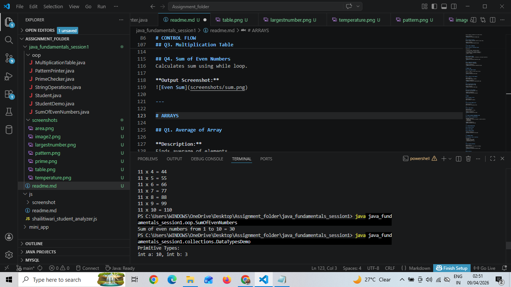

---

# ARRAYS

## Q1. Average of Array
Finds average of elements.

---

## Q2. Sorting (Bubble Sort)
Sorts array in ascending order.

---

## Q3. Linear Search
Searches element in array.

Output Screenshot: 
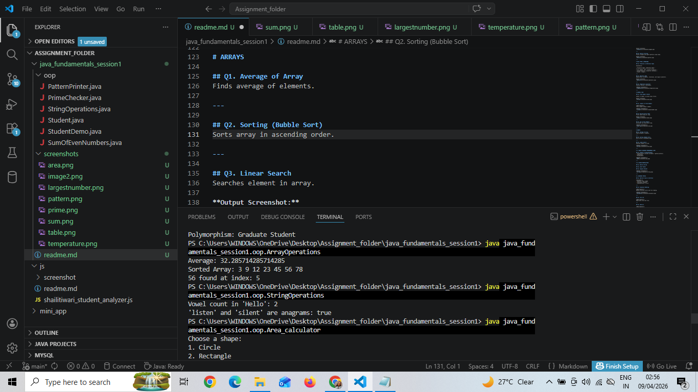

---

#  OBJECT ORIENTED PROGRAMMING (OOP)
## Q1. Student & GraduateStudent
- Encapsulation (private variables + getters/setters)
- Inheritance
- Polymorphism

Output Screenshot:  
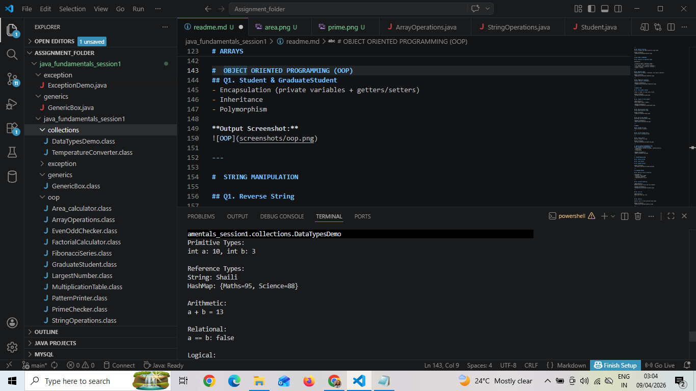

---

#  STRING MANIPULATION

## Q1. Reverse String

## Q2. Count Vowels

## Q3. Anagram Checker

Output Screenshot: 

---

# ⚫ ADVANCED TOPICS
## Q2. Exception Handling
Handles division errors and file reading.

Output Screenshot: 
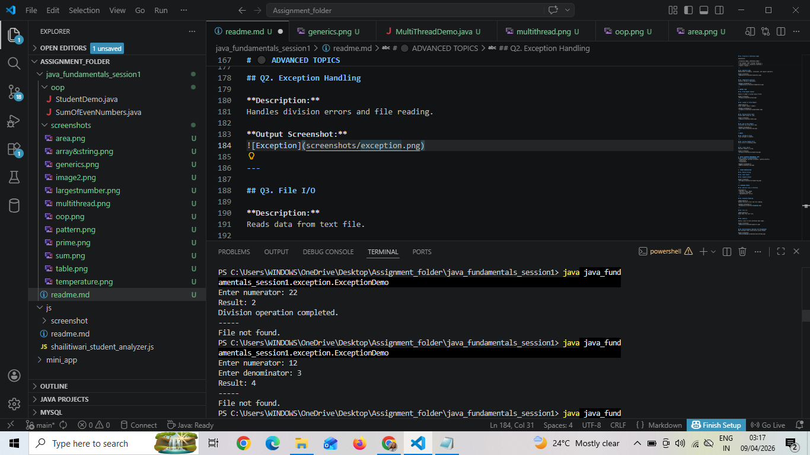

---

## Q3. File I/O
Reads data from text file.

---

## Q4. Generics
 
Generic class to store different data types.

Output Screenshot:  
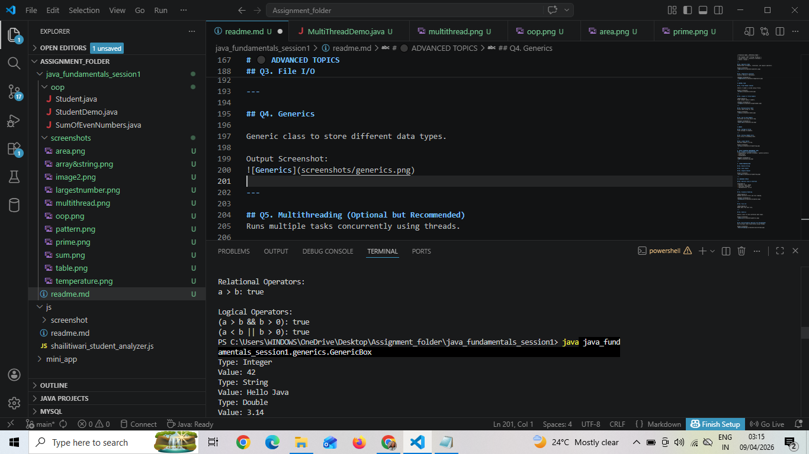

---

## Q5. Multithreading (Optional but Recommended)
Runs multiple tasks concurrently using threads.

Output Screenshot:  
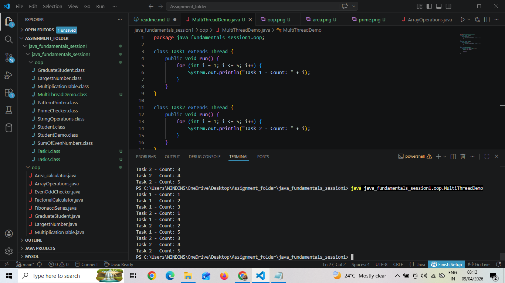
