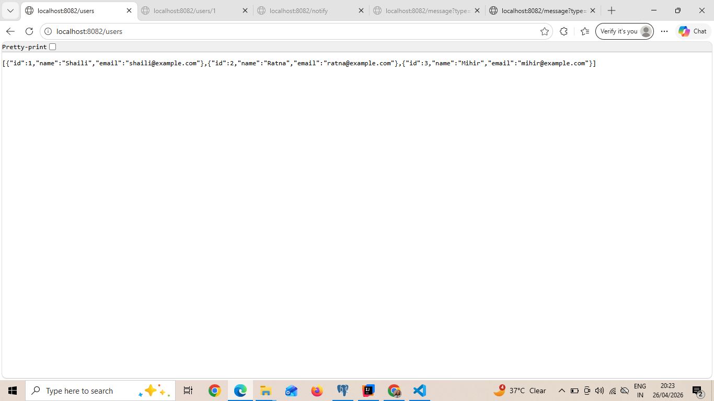
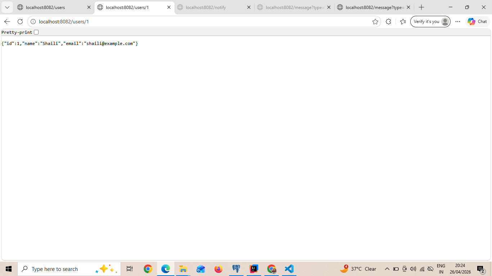
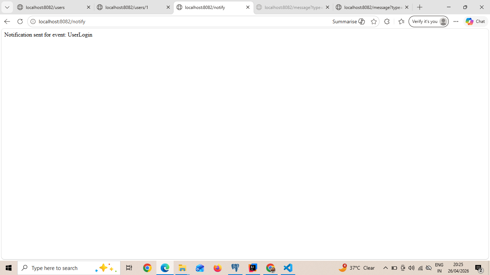
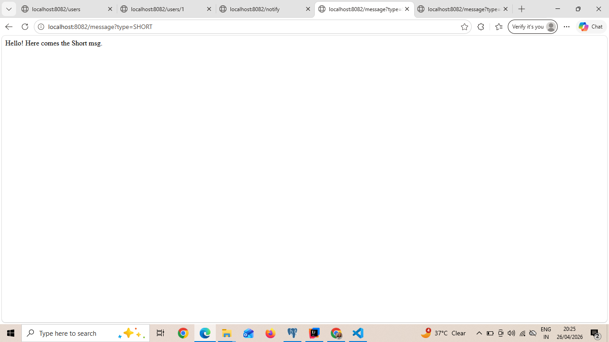
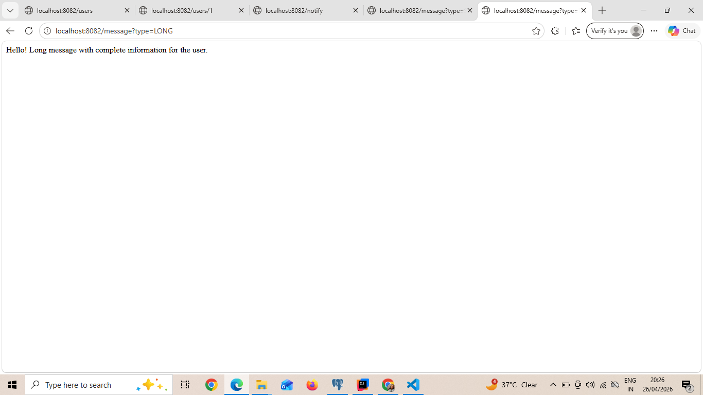

# Spring Boot REST API - Session 2

Student: Shaili Tiwari

---

## What I Built

For this assignment I created a Spring Boot project with three different use cases.
All APIs use constructor injection and follow the Controller, Service, Repository pattern.
No database is used, data is stored in memory.

---
# How to Run

Make sure you have Java 17 and Maven installed.

Open terminal and run:

cd java/session_2/demo
mvn spring-boot:run

The server will start at http://localhost:8082

---
## Use Case 1 - User Management

I created a basic user system with three endpoints.

GET http://localhost:8082/users
Returns list of all users in JSON format.

GET http://localhost:8082/users/1
Returns a single user by their ID.

POST http://localhost:8082/users
Send a JSON body to add a new user.

Example response from /users:
[
  {"id":1,"name":"Shaili","email":"shaili@example.com"},
  {"id":2,"name":"Ratna","email":"ratna@example.com"},
  {"id":3,"name":"Mihir","email":"mihir@example.com"}
]

---

## Use Case 2 - Notification System

A simple notification trigger API. When called it uses a NotificationComponent
to generate and return a message. The component is injected into the service
using constructor injection.

GET http://localhost:8082/notify
Response: Notification sent for event: UserLogin

GET http://localhost:8082/notify?event=Purchase
Response: Notification sent for event: Purchase

---

## Use Case 3 - Dynamic Message Formatter

This API returns different messages based on the type parameter.
There are two components: ShortMessageFormatter and LongMessageFormatter.
The service decides which one to use at runtime. No if-else inside the controller.

GET http://localhost:8082/message?type=SHORT
Response: Hello! Here comes the Short msg.

GET http://localhost:8082/message?type=LONG
Response: Hello! Long message with complete information for the user.

---

# Project Structure

src/main/java/com/example/demo/
    controller/
        UserController.java
        NotificationController.java
        MessageController.java
    service/
        UserService.java
        NotificationService.java
        MessageService.java
    repository/
        UserRepository.java
    model/
        User.java
    notification/
        NotificationComponent.java
    formatter/
        ShortMessageFormatter.java
        LongMessageFormatter.java
    DemoApplication.java

# Screenshots

GET /users

GET /users/1

GET /notify

GET /message SHORT

GET /message LONG

---

# Notes

Port is set to 8082 in application.properties because 8081 was already in use.
No real database connected, using ArrayList as in-memory data store.