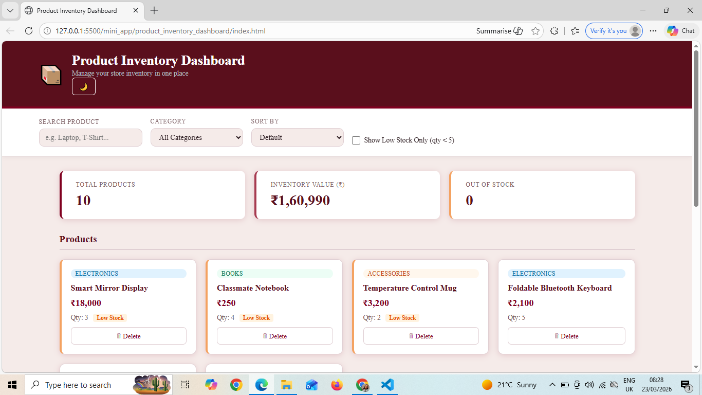
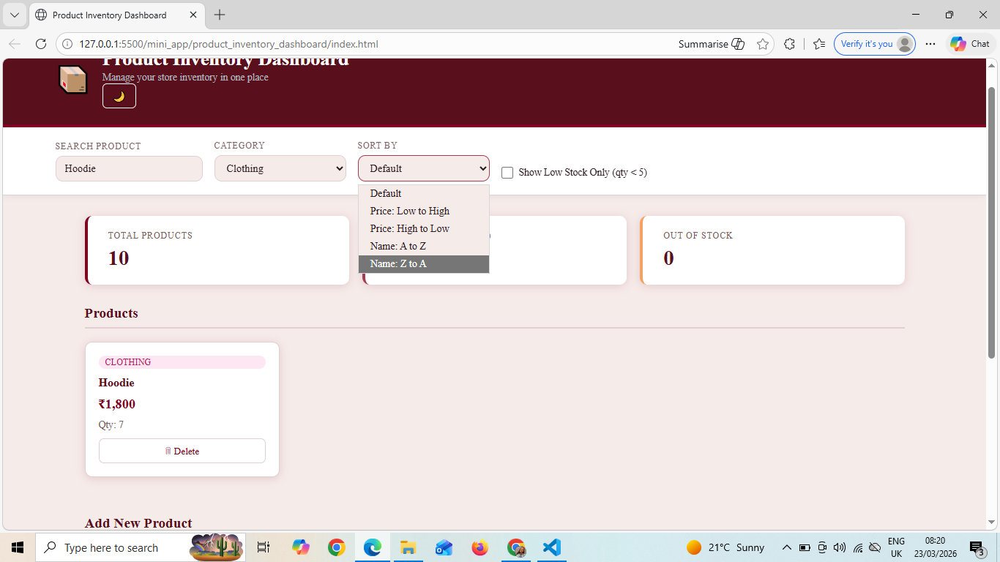
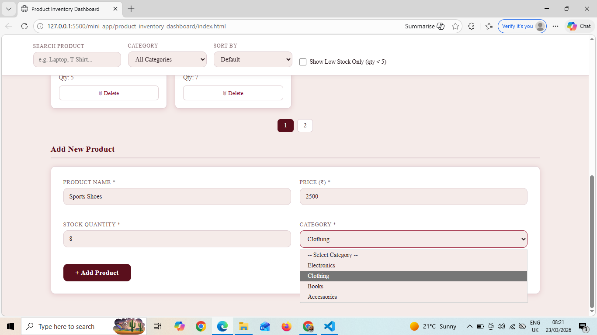
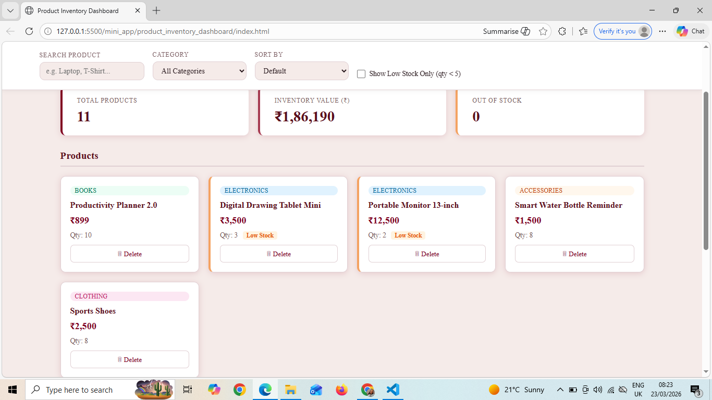
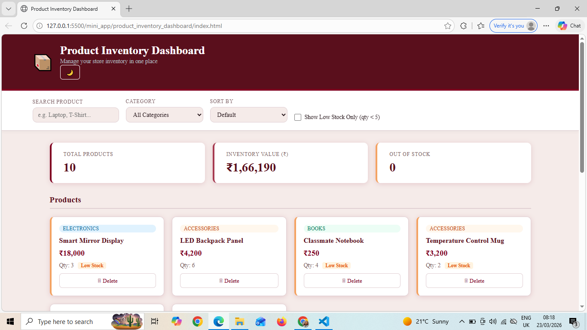
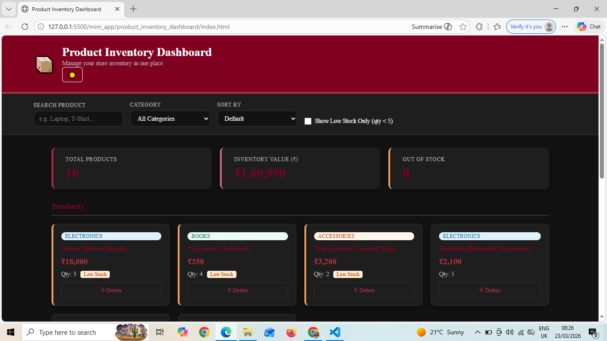

# Product Inventory Dashboard

This is a frontend mini project built using HTML, CSS, and vanilla JavaScript. The goal of this project was to create a simple inventory management dashboard that works completely on the client side.

## What this project does

The dashboard allows users to manage a list of products. You can:

* View all products in a grid layout
* Search products by name
* Filter by category
* Sort products by price or name
* Show only low stock items
* Add new products
* Delete products
* See basic analytics like total products, total inventory value, and out-of-stock count

All data is stored in the browser using localStorage, so the data stays even after refreshing the page.

## Features implemented

* Dynamic rendering using JavaScript (no hardcoded product cards)
* Filtering using array methods
* Sorting using JavaScript sort()
* Analytics using reduce()
* Form validation for adding products
* Delete functionality with real-time UI update
* Pagination for handling large number of products
* Simulated API loading using Promise and setTimeout
* Dark mode toggle with saved preference
* Category-based color badges

## How to run

1. Download or clone the repository
2. Open the project folder
3. Open `index.html` in your browser

No installation or setup is required.

## Folder structure

mini_app/product_inventory_dashboard/

* index.html
* style.css
* script.js

## Notes

* Data is stored in localStorage under the key `inventoryProducts`
* If you want to reset data, clear localStorage from browser or use reset button (if added)

## Screenshots

